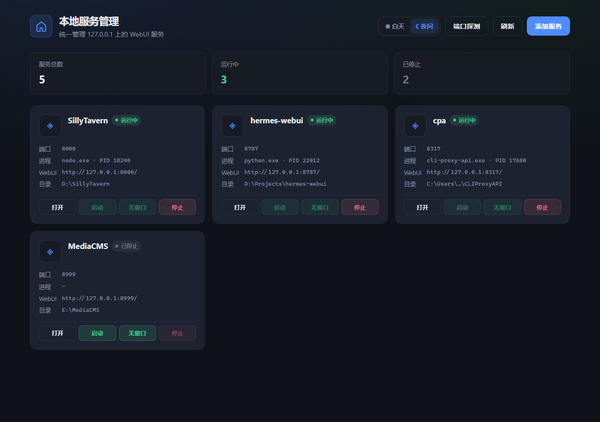
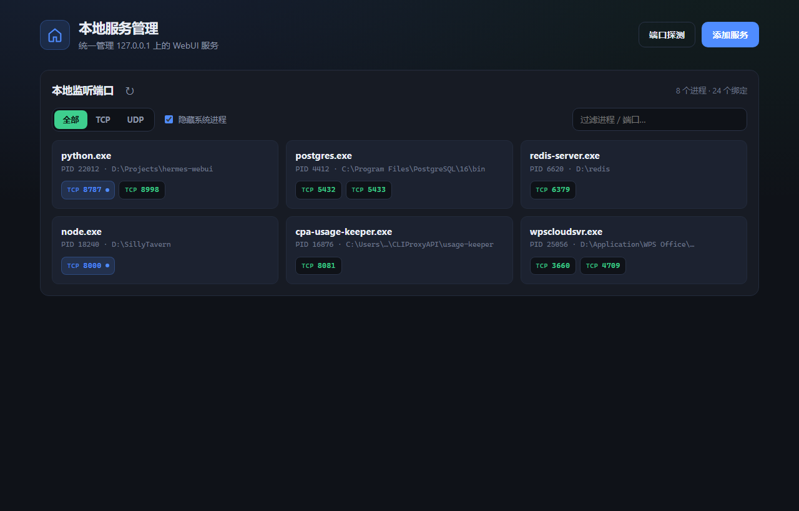
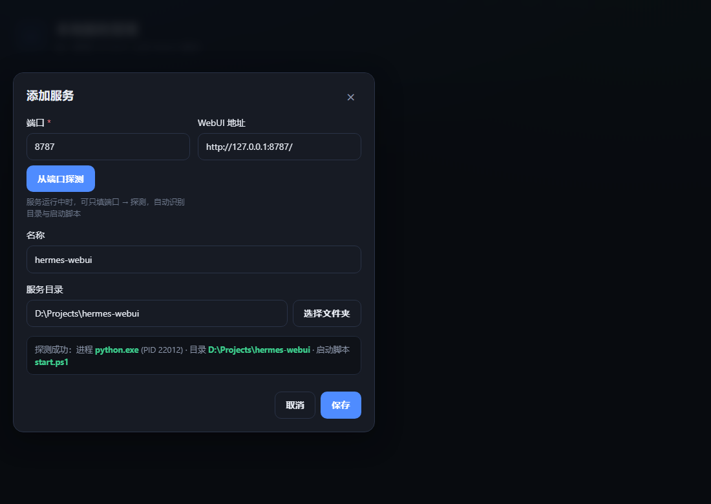

# 本地服务管理 · Local Services Home

> **你是不是也经历过这些瞬间？**
>
> - 本机同时跑着 SillyTavern、数据库面板、AI WebUI、小工具……  
> - 端口记不住，启动脚本散落在各个文件夹，每次都要翻半天  
> - 想关掉某个服务，却不知道是哪个进程、哪个黑窗口  
> - 明明开过一个 WebUI，过几天却忘了它在哪个目录  
>
> **本地服务管理** 就是为这种日常准备的：把 `127.0.0.1` 上的本地 WebUI **登记 → 启停 → 打开** 收进一个桌面小面板。

<p align="center">
  <a href="https://github.com/Mu-scorpio/local-services-home/releases/latest">
    
  </a>
  
  
  
  
</p>

---

## 界面预览

### 一屏看清所有本地 WebUI

白天 / 夜间主题，卡片式管理运行状态、端口、进程与目录。



### 本地监听端口探测

不知道本机还开着什么？一键扫描 TCP/UDP 监听，按进程分组，显示工作目录，点一下即可登记为服务。



### 从端口自动识别目录与脚本

服务跑着的时候，只填端口 →「从端口探测」，自动补全名称、目录和启动脚本。



---

## 它能做什么

| 能力 | 说明 |
|------|------|
| **服务卡片** | 登记端口、目录、启动脚本；一键打开 WebUI |
| **启动 / 无窗口启动 / 停止** | 跑 bat/ps1/sh/zsh/command；停止时按端口结束进程树 |
| **本地监听端口探测** | 类似 FRP 风格的进程分组端口表；过滤 TCP/UDP、隐藏系统进程 |
| **从端口探测添加** | 运行中服务可自动识别目录与脚本 |
| **系统托盘** | 后台常驻；快捷面板 + 主窗口按需打开，减轻闲置占用 |
| **主题** | 白天 / 夜间，本地记忆 |

---

## 30 秒上手

### 方式一：直接用安装包

**Windows**
1. 打开 [Releases](https://github.com/Mu-scorpio/local-services-home/releases/latest)  
2. 下载 **`local-services-home.exe`**（单文件，复制即用）  
3. 双击运行 → 托盘图标 → 快捷面板 / 主窗口  
4. 点 **端口探测** 看看本机都开了啥，或 **添加服务** 登记常用 WebUI  

用户数据：`%LOCALAPPDATA%\Local Services Home\`

**macOS**
1. 下载/构建 **`本地服务管理.app`** 后拖入“应用程序”或直接运行
2. 首次打开若被 Gatekeeper 拦截，可在“系统设置 → 隐私与安全性”中允许
3. 菜单栏出现托盘图标 → 快捷面板 / 主窗口

用户数据：`~/Library/Application Support/Local Services Home/`

管理器地址（两种系统相同）：`http://127.0.0.1:18888`

### 方式二：源码运行

**Windows**

```bat
pip install -r requirements.txt
python -m backend.desktop
```

**macOS / Linux**

```bash
python3 -m pip install -r requirements.txt
python3 -m backend.desktop
```

打包：

- Windows：`build.bat` → `dist\本地服务管理.exe`
- macOS：`./build.sh` → `dist/本地服务管理.app`

---

## 典型工作流

1. **先随便启动一次** 你的本地服务（让端口监听起来）  
2. 打开本工具 → **端口探测** → 找到对应进程 / 端口  
3. 点击端口芯片 → 自动打开「添加服务」并尝试识别目录与脚本  
4. 保存后，以后只需在卡片上点 **启动 / 停止 / 打开**

---

## 技术要点（给在意的人）

- **前端**：原生 HTML / CSS / JS，无构建  
- **后端**：FastAPI + Uvicorn，仅绑定本机  
- **状态**：以「端口是否可连 + 监听进程」为准，而不是脚本是否还在
- **桌面**：pywebview + 系统托盘；闲置时主窗口 / 弹窗按需创建  
- **安全边界**：默认 `127.0.0.1`；脚本路径限制在已登记目录内  

---

## 目录结构

```
backend/     # API、进程/端口、桌面入口
frontend/    # 主窗口 + 托盘快捷面板
docs/        # 截图与文档资源
build.bat    # Windows 一键打成单个 EXE
build.spec
build.sh     # macOS 一键打成 .app
build_mac.spec
```

---

## 许可

个人本地工具。公开仓库时请勿提交含隐私路径的运行时配置。

如果你也受够了「又忘了这个 WebUI 怎么开」，欢迎 Star、Issue 和 PR。
